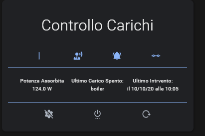
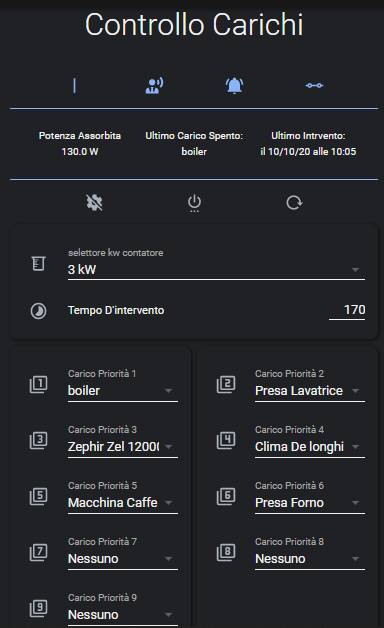
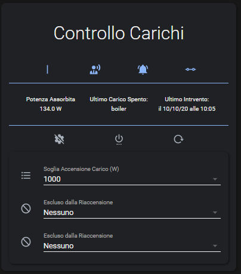

# Package-load-control
Home assistant package that prevents meter detachment

# Requirements:

- Home Assistant version 2021.4 or later
- Configured packages, possibly you can follow our [Guide](https://hassiohelp.eu/2018/11/30/package-configurazione/)
- A sensor that reads the instantaneous power taken from the meter such as [pzem](https://hassiohelp.eu/2019/01/02/consumi-pzem/) or [Shelly EM](https://hassiohelp.eu/2020/01/13/shelly-em/)

# Installation:

- copy the "controllo_carichi.yaml" file into the Home Assistant package folder
- Compile your "secrets.yaml" file as the example

# My Lovelace Card:
> custom: 
  > - [Lovelace Card Mod](https://github.com/thomasloven/lovelace-card-mod)
  > - [Banner Card](https://github.com/nervetattoo/banner-card)
  > - [Lovelace Paper Buttons Row](https://github.com/jcwillox/lovelace-paper-buttons-row)
  > - [Custom Hui Element](https://github.com/thomasloven/lovelace-hui-element)
  > - [State Switch](https://github.com/thomasloven/lovelace-state-switch)
 
 

  

 

  

 

  

If you are not fond of custom cards, I leave below the list of useful entities in the frontend so that you can create your own custom cards:

- automation.innesco_controllo_carichi
- automation.notifica_accensione_carico_hub
- automation.notifica_spegnimento_carico_hub
- automation.accensione_ultimo_carico_spento
- sensor.potenza
- sensor.ultimo_carico
- sensor.data_ultimo_intervento
- input_select.selettore_kw_contatore
- input_number.tempo_intervento
- input_select.carico_1
- input_select.carico_2
- input_select.carico_3
- input_select.carico_4
- input_select.carico_5
- input_select.carico_6
- input_select.carico_7
- input_select.carico_8
- input_select.carico_9
- input_select.accensione_automatica_caric
- input_select.esclusione_1_riaccensione
- input_select.esclusione_2_riaccensione

# Notifications:

The package is ready to send notifications using our [notification center](https://github.com/caiosweet/Package-Notification-HUB-AppDaemon/blob/main/README.md). If you do not use it, just change the action of two simple automations, inserting your notification services:
- automation.notifica_accensione_carico_hub
- automation.notifica_spegnimento_carico_hub
